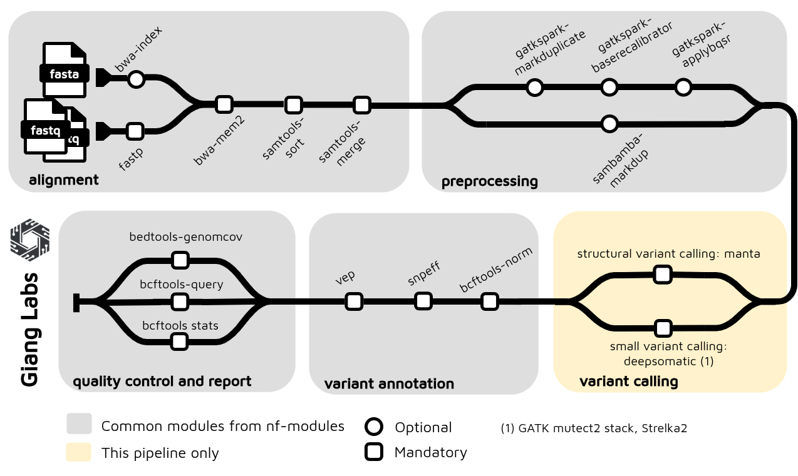

# Nextflow Somatic Short-Read Variant Calling

This repository implements a comprehensive Nextflow pipeline for somatic short-read variant calling, supporting multiple small variant callers (Mutect2, Strelka, DeepSomatic) and structural variant calling (Manta) with integrated quality control and annotation.

## Pipeline Architecture



## Primary Use Case

**Primary support**: **30X whole-genome sequencing (WGS) Illumina short reads with GRCh38 (hg38) alignment**

The pipeline is optimized for the following workflow:

- **Input**: Illumina short-read FASTQ files (~30X coverage) or pre-aligned BAM/CRAM files
- **Quality Filtering**: FASTP for read-level trimming and quality filtering
- **Alignment**: BWA-MEM2 alignment to GRCh38 (hg38) reference genome (or skip if BAM/CRAM input)
- **Preprocessing**: Optional alignment preprocessing (disabled by default)
- **Variant Calling**: 
  - **Small Variants**: Mutect2, Strelka, or DeepSomatic (somatic SNP/INDEL detection)
  - **Structural Variants**: Manta (SV detection)
- **Quality Metrics**:
  - Variant statistics (bcftools stats)
  - Genomic coverage analysis (bedtools genomecov)
- **Variant Annotation**:
  - **SnpEff** (annotation database)
  - **VEP** (Ensembl Variant Effect Predictor)
- **Output**: Annotated VCF files with comprehensive quality metrics

### Configuration for Primary Use Case

```bash
# Default configuration uses:
# - Mutect2 as small variant caller (or strelka/deepsomatic)
# - Manta as structural variant caller (optional)
# - HG38/GRCh38 reference genome
# - FASTP quality filtering
# - Preprocessing optional (skip_preprocessor: true by default)
# - SnpEff + VEP annotation enabled

pixi run nextflow run main.nf -profile docker -resume
```

## Quick Start

### 1. Prepare a Samplesheet

Create a CSV samplesheet with your input. The pipeline requires tumor-normal paired samples and supports three input modes.

**Required Columns** (all modes):

- `patient`: Patient identifier (same for normal/tumor pairs)
- `sex`: Sex of the patient (M/F)
- `status`: Sample type (0 = normal, 1 = tumor)
- `sample`: Sample identifier
- `lane`: Sequencing lane (optional, defaults to L001)

#### Mode A: FASTQ Input (Full Pipeline)

```csv
patient,sex,status,sample,lane,fastq_1,fastq_2
P001,M,0,P001_N,L001,/path/to/P001_N_R1.fastq.gz,/path/to/P001_N_R2.fastq.gz
P001,M,1,P001_T,L001,/path/to/P001_T_R1.fastq.gz,/path/to/P001_T_R2.fastq.gz
P002,F,0,P002_N,L001,/path/to/P002_N_R1.fastq.gz,/path/to/P002_N_R2.fastq.gz
P002,F,1,P002_T,L001,/path/to/P002_T_R1.fastq.gz,/path/to/P002_T_R2.fastq.gz
```

#### Mode B: BAM Input (Skip Alignment)

```csv
patient,sex,status,sample,lane,bam,bai
P001,M,0,P001_N,L001,/path/to/P001_N.bam,/path/to/P001_N.bam.bai
P001,M,1,P001_T,L001,/path/to/P001_T.bam,/path/to/P001_T.bam.bai
P002,F,0,P002_N,L001,/path/to/P002_N.bam,/path/to/P002_N.bam.bai
P002,F,1,P002_T,L001,/path/to/P002_T.bam,/path/to/P002_T.bam.bai
```

#### Mode C: CRAM Input (Skip Alignment + Auto-Convert)

```csv
patient,sex,status,sample,lane,cram,crai
P001,M,0,P001_N,L001,/path/to/P001_N.cram,/path/to/P001_N.cram.crai
P001,M,1,P001_T,L001,/path/to/P001_T.cram,/path/to/P001_T.cram.crai
P002,F,0,P002_N,L001,/path/to/P002_N.cram,/path/to/P002_N.cram.crai
P002,F,1,P002_T,L001,/path/to/P002_T.cram,/path/to/P002_T.cram.crai
```

**CRAM Benefits**:

- **Compressed input**: CRAM files are ~4x smaller than BAM (78% compression)
- **Faster pipeline**: Skip alignment step when re-running variant calling
- **Automatic conversion**: CRAM→BAM conversion integrated into pipeline
- **Supported for all callers**: Mutect2, Strelka, DeepSomatic, and Manta

### 2. Run the Pipeline

#### Standard Run (FASTQ Input)

```bash
nextflow run main.nf \
  --input samplesheet.csv \
  --profile docker \
  -resume
```

#### CRAM Input Example

```bash
# Run with CRAM files (auto-converts to BAM before variant calling)
nextflow run main.nf \
  --input samplesheet_cram.csv \
  --profile docker \
  -resume
```

#### Advanced Options

```bash
# With Manta for structural variants
nextflow run main.nf \
  --input samplesheet.csv \
  --structural_variant_caller manta \
  --profile docker \
  -resume

# Use Strelka instead of Mutect2
nextflow run main.nf \
  --input samplesheet.csv \
  --small_variant_caller strelka \
  --profile docker \
  -resume

# Use DeepSomatic with WGS model
nextflow run main.nf \
  --input samplesheet.csv \
  --small_variant_caller deepsomatic \
  --deepsomatic_model_type WGS \
  --profile docker \
  -resume

# Skip annotation for faster processing
nextflow run main.nf \
  --input samplesheet.csv \
  --profile docker \
  -resume

# Enable alignment preprocessing (e.g., BQSR)
nextflow run main.nf \
  --input samplesheet.csv \
  --preprocessor gatk \
  --profile docker \
  -resume
```

For test mode with sample data:

```bash
nextflow run main.nf -profile docker,test -resume
```

### 3. View Results

Output files will be generated in the `results/` directory. File structure depends on input mode:

#### FASTQ Input Results:

- `results/alignment/*.bam` - Aligned BAM files
- `results/variant_calling/*.vcf.gz` - Raw variant calls
- `results/variant_annotation/*.vcf` - Annotated variants
- `results/qc/` - Quality metrics (variant stats, coverage bedgraph)

#### CRAM Input Results:

- `results/variant_calling/*.vcf.gz` - Raw variant calls (from converted BAM)
- `results/variant_annotation/*.vcf` - Annotated variants
- `results/qc/` - Quality metrics (variant stats, coverage bedgraph)
- No intermediate BAM files (discarded after variant calling unless configured otherwise)

Common output files:

- `results/pipeline_info/` - Execution timeline and trace logs

For more advanced usage and configuration options, see the [Pipeline Architecture](docs/architecture.md) documentation.

## Key Features

- **Multiple Input Formats**: FASTQ (full pipeline), BAM, and CRAM (skip alignment, auto-convert)
- **Somatic Small Variant Callers**: Mutect2, Strelka, DeepSomatic
- **Somatic Structural Variant Callers**: Manta
- **Tumor-Normal Pairing**: Built-in support for matched tumor-normal samples
- **Quality Metrics**: Variant statistics (bcftools), genomic coverage (bedtools)
- **Variant Annotation**: SnpEff, VEP
- **CRAM Support**: Built-in CRAM→BAM conversion for efficient re-calling
- **Flexible Configuration**: Container support (Docker/Singularity), multiple profiles
- **Alignment Preprocessing**: Optional BQSR and other preprocessing steps

## License

MIT ([LICENSE](LICENSE))
